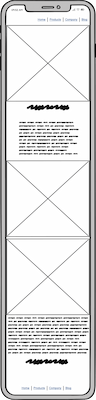
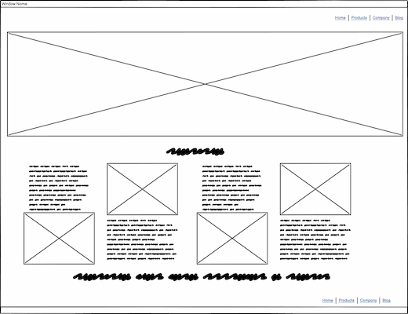
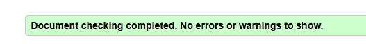

<h1 align="center" id="top">Sunshine Minds</h1>
 

 
<h2 align="center">Welcome to the readme of Sunshine Minds, a website promoting strong mental health. My first individual project from Code Institute</h2>
 
<h2 align="center"><a href="https://paulyduk.github.io/sunshine-minds/">Website Link</a> | <a href="https://github.com/users/PaulyDuk/projects/3">Project Board</a></h2>
<h1>Table of Contents</h1>
<ol>
<li><a href="#introduction">Introduction</a></li>
<ul>
<li><a href="#project-outline">Project Outline</a></li>
<li><a href="#objectives">Key Objectives</a></li>
</ul>
<li><a href="#user-stories">User Stories</a></li>
<ul>
<li><a href="#must-haves">Must Haves</a></li>
<li><a href="#should-haves">Should Haves</a></li>
</ul>
<li><a href="#design">UI/UX Design</a></li>
<ul>
<li><a href="#colour-design">Colour Design</a></li>
<li><a href="#fonts">Fonts</a></li>
<li><a href="#images">Images</a></li>
</ul>
<li><a href="#wireframes">Wireframes</a></li>
<ul>
<li><a href="#phone-wireframe">Phone Wireframe</a></li>
<li><a href="#tablet-wireframe">Tablet Wireframe</a></li>
<li><a href="#desktop-wireframe">Desktop Wireframe</a></li>
</ul>
<li><a href="#features">Features</a></li>
<ul>
<li><a href="#cards">Cards</a></li>
<li><a href="#buttons">Buttons</a></li>
<li><a href="#navbar">Navbar</a></li>
<li><a href="#footer">Footer</a></li>
<li><a href="#links">Links</a></li>
<li><a href="#form">Form</a></li>
</ul>
<li><a href="#ai">AI Implementation</a></li>
<li><a href="#testing">Testing and Validation</a></li>
<ul>
<li><a href="#html-validation">HTML Validation</a></li>
<li><a href="#css-validation">CSS Validation</a></li>
<li><a href="#lighthouse">Lighthouse</a></li>
<li><a href="#contrast1">Card/Text Contrast Score</a></li>
<li><a href="#contrast2">Nav/Footer Contrast Score</a></li>
</ul>
<li><a href="#conclusion">Project Conclusion</a></li>
<li><a href="#credits">Credits</a></li>
</ol>

<h1 id="introduction">Introduction</h1>

Sunshine Minds is my first individually assessed project developed as part of the Code Institute Full Stack Software Developer Bootcamp. This will cover the skills I have covered so far whcih consists of HTML, CSS and Bootstrap, with the use of AI to generate code and assist with debugging.

<h2 id="project-outline">Project Outline:</h2>

The purpose of this website is to raise mental health awareness and what a user can do to improve that via various means, such as physical activity, balanced and healthy diet and sleep improvment. Although a base of hints and tips will be included here additional resources will be linked for the user to explore further. Lastly there will be a contact us page for any additional questions.

<b>External User’s Goal:</b> The user seeks accessible, beginner-friendly information on mental health, including how to recognize common issues and manage stress, presented in a supportive and organised layout.

<b>Site Owner’s Goal:</b> The site owner wants to create a welcoming webpage that provides basic mental health information using a clean and supportive design. The focus is on using HTML and CSS with Bootstrap to create a calming and well-organised user experience.

<h2 id="objectives">Key Objectives:</h2>

- A clean and easy to navigate website that is responsive in design.
- Provide mental health information to the user.
- User will receive uplifting quote and inspiration on the index page.
- A calming color palette and image set to entice the user in further and remain on the page.
- Links to external sources to allow the user to reach further information.

<h1 id="user-stories">User Stories</h1>

<h2 id="must-haves">User Stories- Must Haves:</h2>

- As a Site User, I want to navigate easily through the website so that I can find the information I need.

- As a site user when I enter the site I would like an inviting environment to feel comfortable in.

- As a site user I want to learn what contributes to good mental health

- As a site user I would like to see affirmitive quotes for inspiriation.

- As a site user I would like to contact the site directly for further information.

<h2 id="should-haves">User Stories - Should Haves:</h2>

- As a user I would like to know what additional resources are available to me.

- As a user I would like to know if there are any information that could help me in the moment if I am struggling with my mental health

<h1 id="design">UX/UI Design</h1>

<h2 id="colour-design">Colour Design:</h2>

Given the name of Sunshine Minds I initially decided to go for a blue (simulating the sea) and yellow/orange (simulate the sun) colour scheme. However my initially choices were hard to read and when tested with the webaim.org contrast checker were failing to pass. As such the final colours were tweaked from this and now pass the contrast checker fully. I also believe the colours now look much better and still invite a calming response, with blue backgrounds with a yellow text. I also decided to use a white font in the darker blue navigation and footers for a better contrast and to stand out, as well as not overuse the yellow font throughout the scheme.

<h2 id="fonts">Fonts:</h2>

I decided on two fonts for this project, both sourced from Google Fonts, which was Dancing Script for the headings and Raleway for the body text. I found the Dancing Script font to be playful and simulated cursive handwriting well whereas the body front of Raleway was easily legible for the bulk of the body text. I like the difference between the two and that this helped break up the sections nicely.

<h2 id="images">Images:</h2>

I initially decided to go against using AI for the images as I thought people would be able to relate more to real life images. All images are royalty free from pexels.com and show the situation regarding to the card it is describing. These were later resized and optimised to the web using squoosh.app, A really handy free online tool to do so. I had also initially decided to include logos on the resources page but decided against this, as the colours of the logos did not sit well with my chosen design theme.

The hero image has a gradient applied to allow the text to be legible. My initial thought was to include a suitable hero image on each page but in testing later on this did not suit the site how I had evisaged.

I also decided to add a small image from font-awesome.com for each card for a quick visual respresentation of what the card details would include. I also decided to swap the image between the top of the bottom of the cards to make the site more visually appealing and break up the sections.

<h1 id="wireframes">Wireframes</h1>

Wireframes were important as they gave a visual representation on how I wanted the finish site to look. These took some changes when i was actually impletmenting the site as new ideas came up that would improve the layout. 

<h2 id="phone-wireframe">Phone Wireframe:</h2>

For this the cards will stack on top of each other into a single column, making it easy to navigate on a small screened device. The menu will also be collapsable at the bottom

<h2 id="tablet-wireframe">Tablet Wireframe:</h2>

For the tablet size screens then this will show 2 cards side by side, allowing for more content and less scrolling. The menu bar will also open back up with the links at the top of the page

<h2 id="desktop-wireframe">Desktop Wireframe:</h2>

Lastly the desktop view, this will allow 4 cards side by side to provide the most content, the menu will be fully visible like the tablet view.

<h1 id="features">Features</h1>

The website features a main index page with 8 cards with information regarding improving mental health and the ways to achieve this.  Along with modals for exercises and links to resources and a contact us page

<h2 id="cards">Cards:</h2>

Each card has the text alongside an image relevant to the topic. I decided to break up the 8 cards by having a carousel of inspirational quotes in the middle that automatically rotates. The cards are fully responsive to resize to different size devices and align correctly. 

<h2 id="buttons">Buttons:</h2>

At the bottom of the page are then 8 buttons that list exercises the user can do to help improve their mindfulness (bringing yourself back and being in the moment), clicking the buttons opens up a modal of the exercise with steps the user can follow.

<h2 id="navbar">Navbar:</h2>

Navigation is achieved by a navbar at the top, this sticks to the top of the page and will condense down to a hamburger menu for smaller devices. As the link to mindfulness is an anchor tag on the index page I included additional Javascript code to automatically collapse the menu once clicked, as otherwise the menu would stay open and give a poor user experience.

<h2 id="footer">Footer:</h2>

A footer at the bottom of the page is also included which has social media links to Facebook, Instagrtam, X/Twitter and Linkedin which is also responsive in design, resizing for different display sizes.

<h2 id="links">Links:</h2>

The resources page also utilised cards with links to external websites such as Mind, NHS etc. These include a brief text regarding the site as well as links that open in a new tab.

<h2 id="form">Form:</h2>

Lastly the contact us page has a form with validation to fill out. As we do not have a backend system in place the form will not POST but will redirect the user to a thank you page. I would like to add this functionality in the future.

<h1 id="ai">AI implementation</h1>

AI was used within the code to help generate large code blocks with little effort, both with the chat functionality in VSCode as well as the inline editor for smaller changes. This allowed for rapid design layouts with minimal repitition of coding myself. This would sometimes take a few prompts to get the exact format I was requested. I would also find that sometimes the code would get bloated when trying to revise a layout the AI provided and it was best to clear the code and start again with a more direct prompt. AI was also used to quickly style certain sections, although I would take the code itself to add to my styles.css file manually rather than use the inline CSS it preferred.

A small amount of debugging with AI was also used to help understand some of the code, although this was minimal. I was monstly able to use the skills I have learned so far through Code Institute to understand the code and make any changes requried. AI was also used to write some of the written content, though I checked and verified this information myself to ensure it was correct and relevant.

I found AI to be an incredibly useful tool to implement large code blocks, which would have been time consuming to write myself manually. It was also great at writing the content I wanted to add myself as "placeholder" text until I could verify the information is correct. I also believe I was lucky in that I did not seem to experience any issues with additional closing tags being added in mistakenly, as proven with the testing and validation below.

<h1 id="testing">Testing and Validation</h1>

Testing and Validation was a continuous throughout the project lifecycle. By deploying early I could quickly see my initial design choices were not good enough for the project and changes had to be made for the final product. By also deploying early to github I could some spacing issues that were not present in my live preview of the site locally. When large changes were made to the code I would ensure the code was valid and would pass the W3C validation.

I am happy to report that all pages report no errors or warnings:

<h2 id="html-validation">W3C HTML Validation:</h2>

<h2 id="css-validation">W3C CSS Validation:</h2>

<h2 id="lighthouse">Lighthouse Score:</h2>

<h2 id="contrast1">Card/Text Contrast Score:</h2>

<h2 id="contrast2">Nav/Footer Contrast Score:</h2>

<h1 id="conclusion">Project Conclusion</h1>

I have thoroughly enjoyed creating this website and putting into practice everything I have learned over the previous weeks with Code Institute. I believe I have created a professional looking website in the time I have had available for this project. I particulary enjoyed using the co-pilot AI features within VSCode for quickly templating responsive layouts as well as occasionally using it for debugging. There was some frustration with the AI side but adjusting the prompts usually resulted in better responses. It is definitely not a replacemnt for knowing how to code the website to begin with.

I feel the hardest aspect of this project was the initial planning phase. It became apparent that my initial ideas would not have worked out for the finished product but gave me a good framework to work from to get the MVP available ready for use, before additional adjustments were made. Once the intial ideas were in HTML I felt a lot more enjoyment in making all the little changes to get the finished result.

<h1 id="credits">Credits</h1>

- [Code Insitute](https://codeinstitute.net/) - For providing the training to build this website
- [Bootstrap](https://getbootstrap.com/) - For the responsive site layout tools
- [Pexels.com](https://www.pexels.com/)  - Royalty free images used
- [Flaticon](https://www.flaticon.com/) - Sun Icon
- [favicon.io](https://favicon.io/) - To convert the sun logo to favicons
- [coolors](https://coolors.co/) - Colour palette inspiration
- [Google Fonts](https://fonts.google.com/) - Font libraries used
- [Font Awesome](https://fontawesome.com/) - Icons used for cards
- [Sqoosh](https://squoosh.app/) - Used for image optimisation and compression